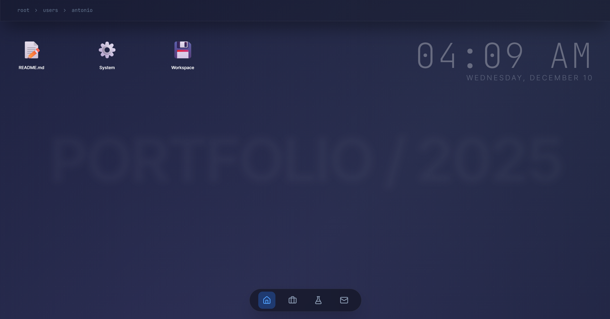

# 🖥️ OS Portfolio

A personal portfolio website reimagined as a fully functional, browser-based Operating System. Built with **Next.js 14**, **TypeScript**, **Tailwind CSS**, and **Framer Motion**.



## ✨ Features

- **Window Management System**: A robust custom window architecture supporting dragging, minimizing, maximizing, and stacking order.
- **Dynamic Dock**: macOS-inspired bottom dock with hover effects and mobile responsiveness.
- **Interactive Apps**:
  - **📝 README**: A markdown-based text editor for project documentation.
  - **⚙️ System**: A "stack" visualization dashboard.
  - **📧 Mail**: A fully functional contact form modeled after a native mail client (integrated with Resend).
  - **📁 Finder**: File system navigation for Projects and Lab experiments.
- **Polished UI/UX**:
  - Glassmorphism design language.
  - Smooth Framer Motion animations for opening, closing, and interactions.
  - Measurement-based pixel-perfect window centering.
  - Responsive design that adapts from desktop to mobile stacks.

## 🛠️ Tech Stack

- **Framework**: [Next.js 14](https://nextjs.org/) (App Router)
- **Language**: [TypeScript](https://www.typescriptlang.org/)
- **Styling**: [Tailwind CSS](https://tailwindcss.com/)
- **Animations**: [Framer Motion](https://www.framer.com/motion/)
- **Icons**: [Lucide React](https://lucide.dev/)
- **Email**: [Resend](https://resend.com/)

## 🚀 Getting Started

1. **Clone the repository**:
   ```bash
   git clone https://github.com/Brkic365/os-portfolio.git
   cd os-portfolio
   ```

2. **Install dependencies**:
   ```bash
   npm install
   ```

3. **Set up Environment Variables**:
   Create a `.env.local` file and add your Resend API key for the contact form:
   ```env
   RESEND_API_KEY=re_your_api_key_here
   ```

4. **Run the development server**:
   ```bash
   npm run dev
   ```

5. **Build for production**:
   ```bash
   npm run build
   ```

## 📂 Project Structure

```
├── app/                  # Next.js App Router pages and API routes
├── components/
│   ├── layout/           # Shell, Dock, Desktop environment
│   ├── modals/           # Application Windows (Contact, OSWindow, StackWindow, etc.)
│   ├── ui/               # Shared UI components (Window wrapper, Button, etc.)
│   ├── views/            # Content views (HomeView, DirectoryView)
│   └── widgets/          # Desktop widgets (Clock)
├── public/               # Static assets
└── types/                # TypeScript definitions
```

## 🎨 Design Philosophy

The goal was to create a portfolio that feels "alive." Instead of a static scroll, users explore the "OS" to find content. Every interaction—from dragging a window to sending an email—is designed to mimic the weight and responsiveness of a native desktop application.

---

*Designed & Built by Antonio Brkić — Full-Stack Engineer.*
